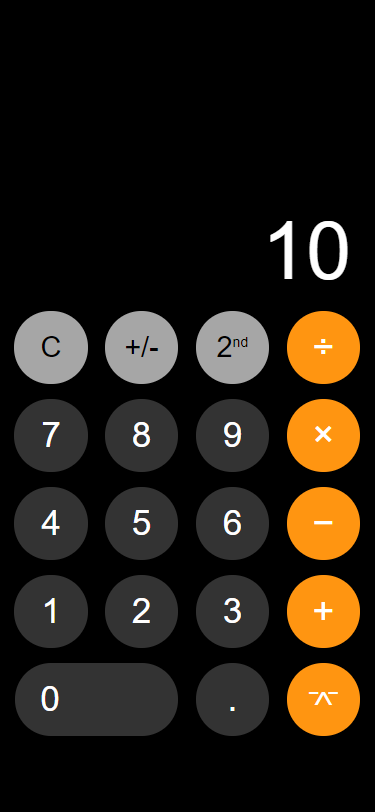

# Calculator

Visually modeled after the iOS 12 calculator and optimized for display on iPhone X.

Functionality based on the HP-41CX, which I used all through college.



## Project setup
```
yarn install
```

### Compiles and hot-reloads for development
```
yarn run serve
```

### Compiles and minifies for production
```
yarn run build
```

### Run your tests
```
yarn run test
```

### Lints and fixes files
```
yarn run lint
```

### Customize configuration
See [Configuration Reference](https://cli.vuejs.org/config/).
